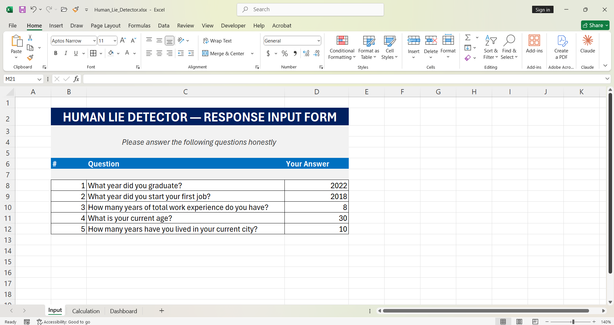
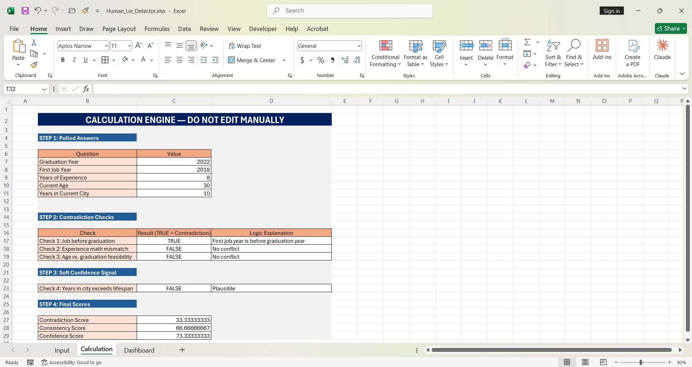
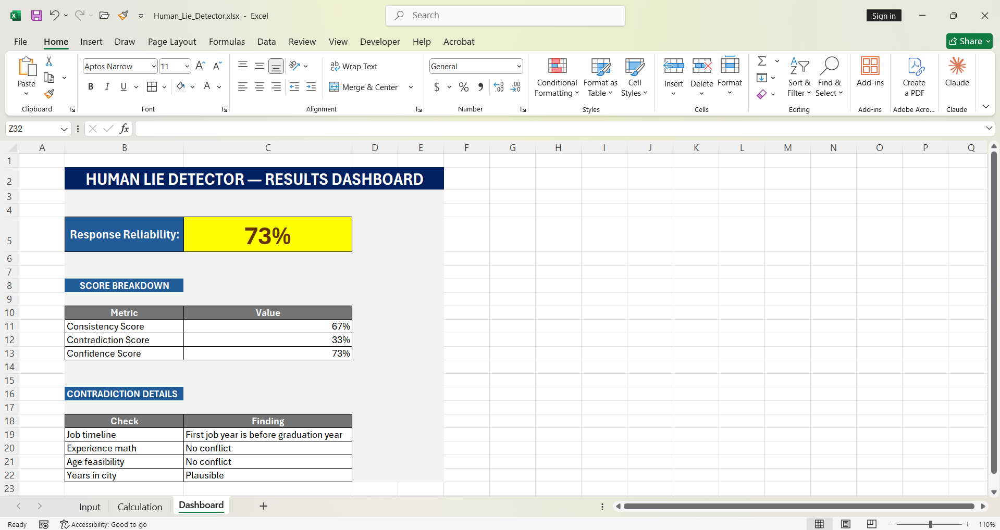

# 🕵️ Human Lie Detector — Excel Probability Engine   

A formula-based contradiction-detection tool built entirely in Excel. A subject answers 5 simple timeline and personal questions, and the engine cross-checks their responses for logical impossibilities — outputting a single "Response Reliability %" score with a full breakdown of findings.   

---

## 📌 Project Overview

People rarely lie with obviously false statements — they lie with small inconsistencies buried across multiple answers. This project simulates how a basic fraud-detection or verification system might work: instead of judging any single answer, it checks whether all the answers are *mathematically consistent with each other*.   

For example, if someone claims they graduated in 2022 but started their first job in 2018, that's not a typo — it's a timeline impossibility. This tool is built to catch exactly that kind of contradiction automatically, using nothing but Excel formulas.   

---

## 🗂️ 3-Sheet Architecture   

This project is built as a connected, single-source-of-truth system across three sheets — each with a distinct responsibility.   

### Sheet 1 — Input   

A styled response form where the subject answers 5 questions:

1. What year did you graduate?    
2. What year did you start your first job?   
3. How many years of total work experience do you have?   
4. What is your current age?   
5. How many years have you lived in your current city?   

- Every field uses **Data Validation** (whole numbers, custom ranges per question) with **custom error alerts** to prevent invalid entries   
- This sheet is the only place data is manually entered — every other sheet pulls from here   

---

### Sheet 2 — Calculation

The hidden logic engine — clearly labeled **"DO NOT EDIT MANUALLY"** since this sheet runs entirely on formulas referencing the Input sheet.   

**Step 1 — Pulled Answers**
Cross-sheet references pull all 5 answers from the Input sheet, keeping a single source of truth.   

**Step 2 — Contradiction Checks (Hard Checks)**
Three independent logic checks run using date and timeline math:   
- **Check 1:** Job year before graduation year (using nested `IF`/`AND`)   
- **Check 2:** Experience years vs. actual timeline mismatch (using `ABS()` for tolerance-based comparison)   
- **Check 3:** Age vs. graduation feasibility, calculated dynamically with `YEAR(TODAY())` so the logic stays accurate year after year   

**Step 3 — Soft Confidence Signal**
One plausibility check (years living in current city vs. lifespan) that flags suspicious-but-not-impossible answers — weighted lighter than the hard checks since it's a softer signal.   

**Step 4 — Final Scores**
Three weighted scores are calculated using `COUNTIF`-based formulas:   
- **Contradiction Score** — % of checks that failed   
- **Consistency Score** — inverse of the contradiction score   
- **Confidence Score** — final weighted score (hard checks weighted 80%, soft check weighted 20%)   

---

### Sheet 3 — Dashboard

The subject-facing results view, translating raw scores into a clean, color-coded summary.   

- **Response Reliability** headline score, manually color-coded green / yellow / red based on the result   
- **Score Breakdown table** — Consistency, Contradiction, and Confidence scores side by side   
- **Contradiction Details table** — plain-English findings for each individual check (e.g. *"First job year is before graduation year"*) so the result isn't just a number, it's explainable 

---

## 🧮 Sample Result Walkthrough

Using the sample data (Graduated 2022, First Job 2018, 8 years experience, Age 30, 10 years in current city):   

| Check | Result | Finding |
|-------|--------|---------|
| Job timeline | ⚠️ Contradiction | First job year is before graduation year |
| Experience math | ✅ No conflict | — |
| Age feasibility | ✅ No conflict | — |
| Years in city | ✅ Plausible | — |

| Final Score | Value |
|-------------|-------|
| Contradiction Score | 33% |
| Consistency Score | 67% |
| **Response Reliability** | **73%** |

One genuine contradiction out of four checks pulls the final reliability score down to 73% — illustrating how the weighting system balances hard logical conflicts against softer plausibility signals rather than treating every check equally.   

---

## 🛠️ Excel Skills & Features Used

| Feature | Purpose |
|---------|---------|
| Nested `IF` / `AND` Logic | Core contradiction-detection rules |
| `ABS()` | Tolerance-based numeric comparisons |
| `YEAR(TODAY())` | Self-updating, always-current date math |
| `COUNTIF`-based Scoring | Converts pass/fail checks into weighted percentages |
| Data Validation + Custom Alerts | Prevents invalid input on the form |
| Cross-Sheet Referencing | Single source of truth across all 3 sheets |
| Manual Conditional Color-Coding | Green/Yellow/Red reliability signal on the dashboard |

---

## 💡 Key Learnings

- How to design a multi-sheet system where each sheet has a single, clear responsibility instead of cramming logic into one tab   
- Translating a real-world verification concept (contradiction detection) into a weighted scoring formula rather than a simple pass/fail check   
- Using `ABS()` and date functions together to build tolerance-based logic instead of rigid exact-match conditions   
- Designing a calculation layer that's explicitly protected from manual edits — a habit borrowed from real spreadsheet engineering practice   
- Presenting a technical result (a probability score) in a way that's explainable to a non-technical end user through the findings table   

---

## 🚀 How to Use

1. Download the `Human_Lie_Detector.xlsx` file   
2. Open it in Microsoft Excel   
3. Go to the **Input** sheet and answer all 5 questions   
4. Switch to the **Dashboard** sheet to see the Response Reliability score and detailed findings   
5. Do not manually edit the **Calculation** sheet — it updates automatically based on the Input sheet   

---

## 👤 Author

**Md. Sirajul Islam**   
📎 [linkedin.com/in/md-sirajul-islam57](https://linkedin.com/in/md-sirajul-islam57)   
🐙 [github.com/sirajul-islam5](https://github.com/sirajul-islam5)   

---

## 📄 License

This project is open source and available under the [MIT License](LICENSE).   

---

> *This is a self-driven project created for learning purpose. It is a logic and probability demonstration tool, not a scientifically validated lie-detection method.*
